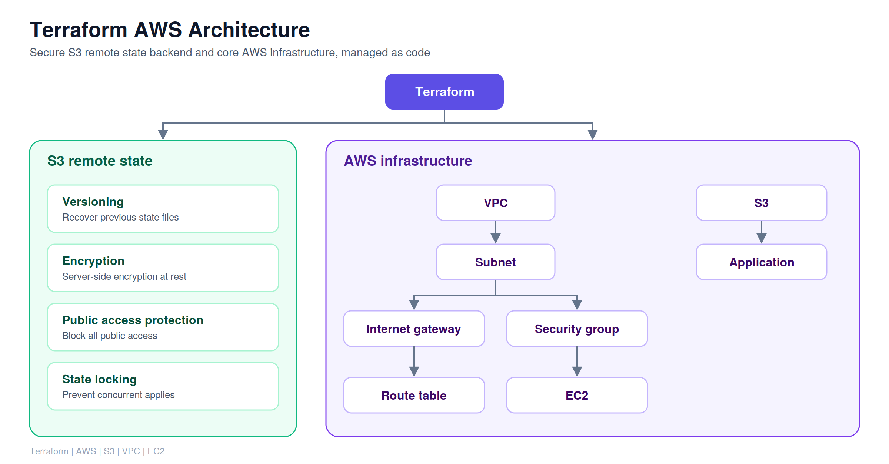

# Terraform AWS Infrastructure

Infrastructure as Code project using **Terraform** to provision and manage AWS infrastructure in a repeatable and modular way.

## Project Overview

This project demonstrates how Terraform can be used to provision an AWS environment consisting of:

* Amazon VPC
* Public subnet
* Internet Gateway
* Route table
* Security Group
* EC2 instance
* S3 bucket
* EC2 SSH key pair
* Remote Terraform state using Amazon S3
* Terraform state versioning, encryption, public-access protection, and state locking
* Reusable Terraform modules

The project uses a modular Terraform structure to separate networking and S3 resources from the root configuration.

---

## Architecture




---

## Technologies Used

* Terraform
* AWS
* Amazon VPC
* Amazon EC2
* Amazon S3
* AWS IAM
* Git
* GitHub

---

## AWS Resources

### Networking

The networking module creates:

* VPC
* Public subnet
* Internet Gateway
* Route table
* Route table association
* Security Group

The project uses:

```text
VPC CIDR:     10.0.0.0/16
Subnet CIDR:  10.0.1.0/24
```

### EC2

The project provisions an Amazon Linux 2023 EC2 instance.

The AMI is selected dynamically using a Terraform data source:

```hcl
data "aws_ami" "amazon_linux" {
  most_recent = true
  owners      = ["amazon"]

  filter {
    name   = "name"
    values = ["al2023-ami-2023*-x86_64"]
  }

  filter {
    name   = "state"
    values = ["available"]
  }
}
```

This avoids hard-coding a specific AMI ID.

### S3

An S3 bucket is provisioned as an application resource.

The bucket name is supplied through a Terraform variable.

---

## Terraform Modules

The project uses reusable modules.

```text
modules/
├── networking/
│   ├── main.tf
│   ├── variables.tf
│   └── outputs.tf
│
└── s3/
    ├── main.tf
    ├── variables.tf
    └── outputs.tf
```

### Networking Module

The networking module manages:

* VPC
* Subnet
* Internet Gateway
* Route table
* Route table association
* Security Group

### S3 Module

The S3 module manages the application S3 bucket.

---

## Remote Terraform State

Terraform state is stored remotely in Amazon S3 instead of being stored only on the local machine.

The backend configuration is:

```hcl
backend "s3" {
  bucket       = "terraform-project-2-state-ishini"
  key          = "terraform.tfstate"
  region       = "ap-southeast-1"
  use_lockfile = true
}
```

The remote state bucket has:

* S3 versioning enabled
* Server-side encryption using AES256
* S3 public-access protection
* Terraform state locking using the S3 backend

The state bucket is managed separately from the main infrastructure project to avoid a dependency cycle during initial creation.

---

## Project Structure

```text
Terraform-aws-infrastructure/
│
├── .gitignore
├── .terraform.lock.hcl
├── README.md
├── main.tf
├── variables.tf
├── outputs.tf
├── terraform.tfvars.example
│
└── modules/
    ├── networking/
    │   ├── main.tf
    │   ├── variables.tf
    │   └── outputs.tf
    │
    └── s3/
        ├── main.tf
        ├── variables.tf
        └── outputs.tf
```

---

## Prerequisites

Install and configure:

* Terraform
* AWS CLI
* Git
* An AWS account
* An AWS IAM user/role with permissions to create the required resources

Verify Terraform:

```bash
terraform --version
```

Verify AWS CLI:

```bash
aws --version
```

Verify AWS authentication:

```bash
aws sts get-caller-identity
```

---

## Configuration

Create a local `terraform.tfvars` file using the example file:

```text
terraform.tfvars.example
```

Example:

```hcl
aws_region      = "ap-southeast-1"
instance_type   = "t3.micro"
vpc_cidr        = "10.0.0.0/16"
subnet_cidr     = "10.0.1.0/24"
environment     = "Dev"
s3_bucket_name  = "your-unique-bucket-name"
```

The actual `terraform.tfvars` file is excluded from Git using `.gitignore`.

Do not commit AWS credentials, private keys, Terraform state files, or other sensitive information.

---

## Deploy the Infrastructure

Initialize Terraform:

```bash
terraform init
```

Format the configuration:

```bash
terraform fmt -recursive
```

Validate the configuration:

```bash
terraform validate
```

Review the planned infrastructure:

```bash
terraform plan
```

Apply the infrastructure:

```bash
terraform apply
```

Terraform will ask for confirmation before creating resources.

---

## View Outputs

After deployment:

```bash
terraform output
```

The project exposes outputs for:

* EC2 instance ID
* EC2 public IP
* S3 bucket name
* VPC ID

Example:

```text
ec2_instance_id = "..."
ec2_public_ip   = "..."
s3_bucket_name  = "..."
vpc_id          = "..."
```

---

## SSH Access

The EC2 instance uses an SSH key pair.

The public key is registered with AWS through Terraform:

```hcl
resource "aws_key_pair" "project_key" {
  key_name   = "terraform-project-key"
  public_key = file(pathexpand("~/.ssh/terraform-project-ec2.pub"))
}
```

After deployment, the public IP can be retrieved with:

```bash
terraform output ec2_public_ip
```

Example SSH command:

```bash
ssh -i ~/.ssh/terraform-project-ec2 ec2-user@<EC2_PUBLIC_IP>
```

---

## Terraform State Management

The main infrastructure project uses an S3 backend.

Terraform state is therefore stored remotely rather than committed to Git.

The state bucket is configured separately using the `Terraform-state-bootstrap` project.

The state bucket provides:

```text
Remote state
Versioning
Encryption
Public-access protection
State locking
```

This allows Terraform state to be shared and managed more safely than keeping the state only on a developer's local machine.

---

## Git and Security

The repository intentionally excludes:

```text
terraform.tfvars
terraform.tfstate
terraform.tfstate.*
.terraform/
```

The Terraform dependency lock file is committed:

```text
.terraform.lock.hcl
```

The repository includes:

```text
terraform.tfvars.example
```

so another developer can understand the required variables without exposing local configuration.

---

## Useful Terraform Commands

Initialize:

```bash
terraform init
```

Format:

```bash
terraform fmt -recursive
```

Validate:

```bash
terraform validate
```

Preview changes:

```bash
terraform plan
```

Create/update infrastructure:

```bash
terraform apply
```

Show outputs:

```bash
terraform output
```

Show Terraform state:

```bash
terraform state list
```

Destroy the infrastructure:

```bash
terraform destroy
```

---

## Cleanup

When the infrastructure is no longer required:

```bash
terraform destroy
```

Review the plan carefully before confirming.

The remote state bucket is managed separately by the bootstrap project and should not be deleted casually because the main Terraform project depends on it for remote state.

---

## What This Project Demonstrates

This project demonstrates practical experience with:

* Infrastructure as Code
* Terraform
* AWS infrastructure provisioning
* Terraform modules
* Terraform variables and outputs
* Terraform data sources
* AWS VPC networking
* EC2 provisioning
* S3
* Remote Terraform state
* State versioning
* State locking
* State encryption
* Infrastructure security
* Git version control
* Infrastructure lifecycle management

---

## Author
A O M Ishini Shavindhya
DevOps / Cloud Engineering portfolio project demonstrating Infrastructure as Code with Terraform and AWS.
